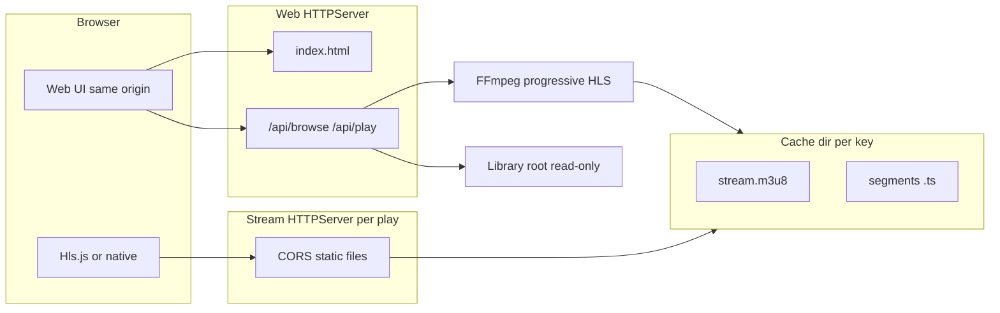

# FFmpeg HTTP browser — design and summary

This document describes **`ffmpeg-http-browser`**: a web UI to browse a local video library, start HLS playback in the browser, and reuse transcoded output on disk. The original **`ffmpeg-http-streamer`** CLI (single video, VLC-style live HLS) is unchanged.

## Summary

- **Web port**: One process serves the HTML UI and JSON API on `--web-port` (binds `0.0.0.0`).
- **Stream ports**: Each **Play** action allocates a **dedicated port** that serves only that session’s HLS directory from the **cache**. Responses include **CORS** headers so the page (different origin: different port) can load `stream.m3u8` and `.ts` in Chromium via **hls.js**; Safari can use native HLS where supported.
- **Cache**: HLS segments and `stream.m3u8` live under `--cache-dir`, in a subdirectory keyed by **resolved path + mtime + size + transcode flag + cache profile version**. A **complete** cache has `#EXT-X-ENDLIST` and all listed segments present; then **no FFmpeg** is started for that key until the source changes.
- **Progressive first play**: On a **cache miss**, FFmpeg runs in **EVENT** HLS mode (growing playlist, segments kept). The API returns after the **first playable segment** exists; encoding continues in the background. **`ffprobe`** supplies **`durationSec`** immediately so the UI can show total length while the encode catches up.
- **Player**: [`static/index.html`](../src/ffmpeg_http_streamer/static/index.html) uses **hls.js** from a CDN (with native HLS fallback). Seeking ahead of the encode frontier may buffer until segments exist.

---

## Architecture



### Components (code)

| Piece | Role |
|-------|------|
| [`browser_main.py`](../src/ffmpeg_http_streamer/browser_main.py) | CLI, validates ports/paths, starts web server, shutdown hooks. |
| [`browser_server.py`](../src/ffmpeg_http_streamer/browser_server.py) | `WebUIHandler`: routes for UI and JSON API. |
| [`browse_app.py`](../src/ffmpeg_http_streamer/browse_app.py) | Path safety under `--library`, cache keys, encode job per key, session registry, stream port allocation. |
| [`streaming.py`](../src/ffmpeg_http_streamer/streaming.py) | Shared codec logic (`transcode_maps_for_input`), **live** HLS for legacy CLI, **progressive EVENT** HLS for cache, `run_cors_http_server_process` for stream ports. |
| [`probe_duration.py`](../src/ffmpeg_http_streamer/probe_duration.py) | `ffprobe` JSON → duration seconds. |
| [`network.py`](../src/ffmpeg_http_streamer/network.py) | `is_port_free_any_host` for `0.0.0.0` binds. |

### Why two port tiers?

- Keeps the **browse URL** stable on one port.
- Reuses the proven model **one HTTP server root = one HLS tree** (`stream.m3u8` + `.ts`) without multiplexing many streams on one path.
- **Trade-off**: multiple open ports in the configured stream range; tune `--stream-port-min` / `--stream-port-max` and `--max-streams`.

### Cache key and invalidation

The key hashes:

- Absolute resolved source path  
- File `mtime` and `size`  
- Whether `--transcode` is on  
- `CACHE_PROFILE_VERSION` in [`constants.py`](../src/ffmpeg_http_streamer/constants.py) (bump when FFmpeg HLS arguments change)

Changing the file on disk or encoder profile produces a **new** cache subdirectory.

### FFmpeg modes

1. **Legacy CLI** (`ffmpeg-http-streamer`): live-style HLS (`-re`, sliding window, `delete_segments`, absolute `hls_base_url` for LAN players).
2. **Browser cache fill**: no `-re`, `-hls_playlist_type event`, `-hls_list_size 0`, no `delete_segments`, relative segment URLs; on successful completion the playlist should receive `#EXT-X-ENDLIST` (FFmpeg behavior for event playlists at EOF). A `.ready` JSON file may be written for metadata after success.

---

## HTTP API

| Method | Path | Purpose |
|--------|------|---------|
| GET | `/` | Single-page UI (`static/index.html`). |
| GET | `/api/browse?path=` | JSON: `directories`, `videos` (paths relative to library root), `path`. |
| POST | `/api/play` | Body: `{"path":"relative/to/video.mp4"}`. Response: `streamId`, `playlistUrl`, `durationSec`, `cacheKey`. Uses `Host` for playlist host when possible. |
| DELETE | `/api/streams/<streamId>` | Stops that stream’s HTTP server; does **not** delete cache; does not stop shared FFmpeg for the cache key unless you extend that behavior. |

Stream servers respond with **`Access-Control-Allow-Origin: *`** on media files for simple LAN use.

---

## CLI reference

```text
ffmpeg-http-browser -p <web-port> --library <abs-dir> \
  [-d <cache-dir>] [-t] \
  [--stream-port-min N] [--stream-port-max N] [--max-streams N]
```

- **`-p / --web-port`**: Required; must lie in `49152–65535` (same range as the original tool).
- **`--library`**: Root directory to browse; entries are constrained under this path (traversal rejected).
- **`-d / --cache-dir`**: Defaults under the user home cache path; created if needed.
- **`-t / --transcode`**: Same semantics as the main streamer when remux is not enough (H.264/AAC).
- **Stream range**: First free port in `[min, max]` excluding the web port is chosen per play.

---

## Security notes (LAN-oriented)

- No authentication; intended for **trusted networks** only.
- Library paths are **canonicalized** and must stay under `--library`.
- CORS `*` on stream ports allows any origin to request media URLs if they are guessed; tighten to a specific origin if you expose beyond a home LAN.
- Cap concurrent streams with `--max-streams` to limit resource use.

---

## Operational notes

- **Shutdown**: Ctrl+C stops stream HTTP servers and terminates in-flight FFmpeg encoders; cache files remain for reuse.
- **CDN**: The default UI loads **hls.js** from jsDelivr; offline or locked-down networks may need a vendored copy under `static/`.
- **Compatibility**: Python 3.7+, FFmpeg/ffprobe on `PATH`, same broad video extensions as the main project.
